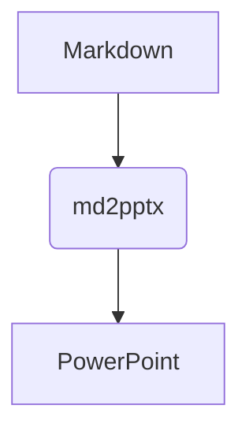

# md2pptx - Markdown to PowerPoint Converter

Markdownファイルから美しいPowerPoint（.pptx）スライドを自動生成するPythonスクリプトです。
技術資料、要件定義書、プロジェクト提案書などをテキストベースで素早く作成し、デザインの微調整にかかる時間を大幅に削減します。

## ✨ 主な機能

* **賢いオートレイアウト**
  * テキストと画像（または表）が混在している場合、自動で2カラムレイアウトや上下分割レイアウトに整形します。
  * 画像はスライドからはみ出さないよう、アスペクト比を維持して自動リサイズ・中央配置されます。
* **エンジニア向け記法の完全サポート**
  * **インライン装飾・コードブロック:** 等幅フォントやシンタックスカラーを適用。
  * **Mermaid図形の自動生成:** ````mermaid ```` ブロックを自動的にPNG画像に変換してスライドに挿入（[Kroki API](https://kroki.io/)を使用）。
  * **ネイティブTable生成:** Markdownの表をPowerPointのネイティブな表オブジェクトに変換。
* **スピーカーノート対応**
  * 引用ブロック（`> `）で書かれたテキストは、スライド本文ではなく「ノート」領域に書き込まれます。
* **柔軟なカスタマイズ (`config.yaml`)**
  * フォントサイズ、色、太字設定などを見出しレベルや要素ごとに細かく設定可能。
  * 社内指定のPPTXテンプレートの読み込みにも対応。

## 📦 動作環境とインストール

Python 3.x 環境が必要です。以下の外部ライブラリをインストールしてください。
```bash
pip install python-pptx markdown beautifulsoup4 requests PyYAML
```

## 🚀 使い方

基本コマンド:
```bash
python md2pptx.py input.md -o output.pptx -c config.yaml
```

* `input.md`: 変換元のMarkdownファイル
* `-o`, `--output`: 出力するPPTXファイル名（デフォルト: `output.pptx`）
* `-c`, `--config`: スタイル設定を記述したYAMLファイル（デフォルト: `config.yaml`）

## 📝 Markdownの書き方とスライドへの反映

### 1. スライドの生成とレイアウト
* `# (見出し1)`: **タイトルスライド**を生成します。
* `## (見出し2)`: **コンテンツスライド**を生成します。

### 2. テキストとリスト
通常のテキスト、およびネストされたリスト（`-` や `*`）に対応しています。
`**太字**`、`*斜体*`、`` `インラインコード` `` の装飾も反映されます。

### 3. スピーカーノート（発表者ツール）
引用記法（`>`）を使用すると、スライド画面には表示されず、ノート領域にのみテキストが追加されます。
```markdown
> ここは発表用のスクリプトです。
> スライド下部のノート欄に入力されます。
```

### 4. 画像とオートレイアウト
画像の配置はスクリプトが自動で計算します（`config.yaml`での固定も可能）。
* スライドに**テキストがある**場合: テキスト枠を左に縮め、画像を**右側**に配置（2カラムレイアウト）。
* スライドに**画像しかない**場合: スライドの**中央**に大きく配置。

### 5. 表 (Table)
Markdownの表は自動的にPPTXの表になります。テキストと混在する場合はスライドの下半分に配置されます。

### 6. Mermaid (構成図・フローチャート)
コードブロックの言語を `mermaid` に指定するだけで、自動で図解化されます。
*(※変換処理にKroki APIを使用するため、インターネット接続が必要です)*


## ⚙️ 設定ファイル (`config.yaml`)

`config.yaml` では、スライドの画角（16:9等）や各要素のフォントスタイルを定義します。

```yaml
slides:
  # template_path: "company_template.pptx" # テンプレートを使う場合はパスを指定
  layout: "16:9"

fonts:
  title_h1:
    name: "Meiryo"
    size_pt: 44
    bold: true
  body:
    name: "Meiryo"
    size_pt: 20
  code_block:
    name: "Consolas"
    size_pt: 12
    color_rgb: [0, 80, 160]
  table_header:
    name: "Meiryo"
    size_pt: 14
    bold: true
    color_rgb: [255, 255, 255]
```

## ⚠️ 制限事項
* `python-pptx` の仕様上、コードブロックの「背景色」の変更には対応していません。代わりに文字色とフォントで区別します。
* Mermaid図形の変換には外部API（Kroki）を使用しています。機密性の高いシステム構成図などを変換する場合はご留意ください。