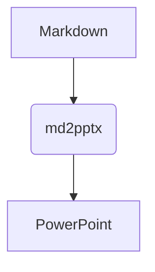

# md2pptx - Markdown to PowerPoint Converter

[](https://github.com/Toshiaki0315/md2pptx/actions/workflows/ci.yml)

Markdownファイルから美しいPowerPoint（.pptx）スライドを自動生成するPythonスクリプトです。
技術資料、要件定義書、プロジェクト提案書などをテキストベースで素早く作成し、デザインの微調整にかかる時間を大幅に削減します。

## ✨ 主な機能

* **賢いオートレイアウト**
  * テキストと画像（または表）が混在している場合、自動で2カラムレイアウトや上下分割レイアウトに整形します[cite: 1, 2, 3]。
  * 画像はスライドからはみ出さないよう、アスペクト比を維持して自動リサイズ・中央配置されます。
  * 画像・表・コード枠の配置は**スライドの画角に追従**します（`16:9` / `4:3` / `16:10` / `A4`）。
* **エンジニア向け記法の完全サポート**
  * **インライン装飾・コードブロック:** 等幅フォントやシンタックスカラーを適用[cite: 2]。
  * **Mermaid図形の自動生成:** ````mermaid ```` ブロックを自動的にPNG画像に変換してスライドに挿入[cite: 3]。[Kroki API](https://kroki.io/)（自己ホスト可）またはローカルの mermaid-cli を選択できます。
  * **ネイティブTable生成:** Markdownの表をPowerPointのネイティブな表オブジェクトに変換[cite: 2]。
* **スピーカーノート対応**
  * 引用ブロック（`> `）で書かれたテキストは、スライド本文ではなく「ノート」領域に書き込まれます[cite: 2, 3]。
* **柔軟なカスタマイズ (`config.yaml`) & フロントマター**
  * 箇条書きレベルや要素ごとのフォント設定が可能。
  * Markdown先頭にYAMLフロントマターを記述し、タイトルスライドを自動生成可能。
* **レイアウトの強制指定**
  * `<!-- layout: 2-column -->` や `<!-- layout: center -->` などのHTMLコメントにより、スライドレイアウトを自由に上書き指定できます。

## 📦 動作環境とインストール

Python 3.x 環境が必要です。依存ライブラリは `requirements.txt` にまとめています。

```bash
pip install -r requirements.txt
```

仮想環境を使う場合:
```bash
python -m venv .venv && source .venv/bin/activate && pip install -r requirements.txt
```

## 🚀 使い方

基本コマンド:
```bash
python md2pptx.py input.md -o output.pptx -c config.yaml
```

* `input.md`: 変換元のMarkdownファイル
* `-o`, `--output`: 出力するPPTXファイル名（デフォルト: `output.pptx`）
* `-c`, `--config`: スタイル設定を記述したYAMLファイル（デフォルト: `config.yaml`）

終了コードは成功時が `0`、入力・設定ファイルの不備や書き込み失敗時が `1` です（CI等での判定に利用できます）。

## 🧪 テスト環境の構築と実行

本プロジェクトでは品質維持のため、`pytest` によるユニットテストを導入しています。

### 1. 開発用ライブラリのインストール
テスト・型チェックに必要なものは `requirements-dev.txt` にまとめています（実行用の依存も含みます）。
```bash
pip install -r requirements-dev.txt
```

### 2. テストとカバレッジの計測
```bash
pytest
```
カバレッジの計測は `pyproject.toml` で既定に設定してあるため、`pytest` だけで網羅率まで表示されます。

現在のカバレッジは **99%**（322テスト）です。外部API（Kroki / mermaid.ink）やHTTP画像取得、mermaid-cli の呼び出しはすべてモック化しているため、テスト実行時にネットワーク接続や追加ツールは不要です。

### 3. 型チェック（mypy）
全モジュールに型アノテーションを付与しています。設定は `pyproject.toml` の `[tool.mypy]` にあります。
```bash
mypy .
```

### 4. まとめてチェックする
テストと型チェックをまとめて実行します。片方が失敗しても両方の結果を表示します。
```bash
sh scripts/check.sh
```

### 5. push前の自動チェック
CIの代わりに、**push時に上記のチェックを自動実行**できます。クローンごとに1度だけ以下を設定してください。
```bash
git config core.hooksPath .githooks
```

以降、`git push` のたびにテストと型チェックが走り、**失敗するとpushが中止されます**。

```
==> テスト (pytest)
267 passed
==> 型チェック (mypy)
Success: no issues found in 8 source files
すべてのチェックを通過しました。
```

急ぐ場合は `git push --no-verify` でスキップできます。
仮想環境のPythonを明示したい場合は `PYTHON` で指定できます。
```bash
PYTHON=.venv/bin/python sh scripts/check.sh
```

### 6. CI（GitHub Actions）
push と Pull Request のたびに、**Python 3.11 / 3.12 / 3.13** でテストと型チェックが自動実行されます（`.github/workflows/ci.yml`）。

CIはローカルの `scripts/check.sh` をそのまま実行するため、**手元とCIで結果が食い違いません**。

あわせて `sample.md` の変換を実行し、生成された `sample.pptx` を成果物（Artifacts）として保存します。実行結果の画面からダウンロードして、実際の見た目を確認できます。

## 📝 Markdownの書き方とスライドへの反映

### 1. スライドの生成とレイアウト
* `# (見出し1)`: **タイトルスライド**を生成します[cite: 1, 2, 3]。
* `## (見出し2)`: **コンテンツスライド**を生成します[cite: 1, 2, 3]。

### 2. テキストとリスト
通常のテキスト、およびネストされたリスト（`-` や `*`）に対応しています[cite: 1, 2, 3]。
段落やリスト間の余白・行間は美しくなるよう自動で調整されます。
本文が枠に収まらない場合は、**全角/半角を考慮した折り返し行数から必要な高さを概算**し、フォントサイズと余白を自動で縮小します（下限は元の60%）。
`**太字**`、`*斜体*`、`` `インラインコード` `` の装飾も反映されます[cite: 2]。

### 3. スピーカーノート（発表者ツール）
引用記法（`>`）を使用すると、スライド画面には表示されず、ノート領域にのみテキストが追加されます[cite: 2, 3]。
```markdown
> ここは発表用のスクリプトです。
> スライド下部のノート欄に入力されます。
>
> 【発表のポイント】
>
> * 段落は空行で区切られます
> * 箇条書きは項目ごとに改行されます
```
引用の中に書いた箇条書きや表はノートにのみ入り、スライド本文には表示されません。

### 4. 画像とオートレイアウト
画像の配置はスクリプトが自動で計算します[cite: 1, 2, 3]。
* スライドに**テキストがある**場合: テキスト枠を左に縮め、画像を**右側**に配置（2カラムレイアウト）[cite: 1, 2, 3]。
* スライドに**画像しかない**場合: スライドの**中央**に大きく配置[cite: 1, 2, 3]。

画像の**代替テキスト**（`` の「説明」）は、図形の説明としてPPTXに設定されます。スクリーンリーダーでの読み上げや、アクセシビリティチェックに対応するためです。

#### 画像の自動縮小（ファイルサイズ削減）
高解像度の写真や図をそのまま埋め込むと、出力ファイルが不必要に肥大します。
本ツールは**スライド上の表示サイズに対して過大な解像度の画像を自動で再サンプリング**します。

| | 縮小なし | 縮小あり（既定・150dpi） |
| :--- | ---: | ---: |
| `sample.md` の出力 | 4.76 MB | **1.03 MB** |

* 元画像が既に十分小さい場合、および再エンコードでかえってサイズが増える場合（色数の少ない図版など）は元画像をそのまま使います。
* 縮小に失敗しても変換は止まらず、元画像で処理を継続します。
* `config.yaml` で解像度の変更・無効化ができます。

```yaml
images:
  downscale: true   # false で無効化（元の解像度のまま埋め込む）
  dpi: 150          # 150=印刷品質相当 / 96=画面表示相当（よりファイルが小さくなる）
```

### 5. 表 (Table)
Markdownの表は自動的にPPTXの表になります。テキストと混在する場合はスライドの下半分に配置されます[cite: 2, 3]。

Markdownの**列揃え指定**（`:---` / `:---:` / `---:`）はセルの配置として反映されます。

```markdown
| 左寄せ | 中央 | 右寄せ |
| :--- | :---: | ---: |
| a | b | c |
```

行数が多い表は、**まず文字を縮めて1枚に収めることを試み、それでも収まらない場合はスライドを分割**します。
分割後のスライドにはタイトルに「（続き）」が付き、**見出し行が各ページの先頭に繰り返されます**。

```
INFO: 表が1枚に収まらないため、4枚のスライドに分割しました。
```

### 6. コードブロック (Pygments対応)
プログラムのコードブロックは、`Pygments` により自動的にシンタックスハイライト（色付け）され、背景色付きの美しい専用テキストボックスとして挿入されます。

### 7. Mermaid (構成図・フローチャート)
コードブロックの言語を `mermaid` に指定するだけで、自動で図解化されます[cite: 3]。

```mermaid
graph TD
    A[Markdown] --> B(md2pptx)
    B --> C[PowerPoint]
```

#### ⚠️ 図の送信先について（機密情報の取り扱い）
既定の `renderer: kroki` は、**図のソースを外部の公開サービス（kroki.io）へ送信**して画像化します。
システム構成図やデータフローなど社外に出せない情報を扱う場合は、`config.yaml` で送信先を変更してください。

```yaml
mermaid:
  renderer: "kroki"            # kroki | local | off
  endpoint: "https://kroki.io" # 自己ホストしたKrokiのURLを指定できます
  warn_on_external: true       # 公開サービスへ送信する際に警告を表示
```

| 設定 | 動作 | 外部送信 |
| :--- | :--- | :--- |
| `renderer: kroki`（既定） | Kroki で画像化 | **あり**（`endpoint` が公開サービスの場合） |
| `renderer: kroki` + 自己ホスト `endpoint` | 社内のKrokiで画像化 | なし |
| `renderer: local` | mermaid-cli でオフライン生成 | なし |
| `renderer: off` | 図を生成しない | なし |

**フォールバックの挙動:** Kroki が応答しない場合、公開API（mermaid.ink）への切り替えは
**公開エンドポイントを使用している場合のみ**行われます。自己ホストの `endpoint` を指定している場合、
障害時に図が外部へ送信されることはありません（`fallback_to_public: true` で明示的に許可しない限り）。

**オフライン生成（`renderer: local`）を使う場合**は mermaid-cli が必要です。
```bash
npm install -g @mermaid-js/mermaid-cli
```

## ⚙️ 設定ファイル (`config.yaml`)

`config.yaml` では、スライドの画角（16:9等）や各要素のフォントスタイルを定義します。
```yaml
slides:
  # template_path: "company_template.pptx" # テンプレートを使う場合はパスを指定
  layout: "16:9"

fonts:
  title_h1:
    name: "Meiryo"
    size_pt: 44
    bold: true
  body:
    name: "Meiryo"
    size_pt: 20
  code_block:
    name: "Consolas"
    size_pt: 12
    color_rgb: [0, 80, 160]
  table_header:
    name: "Meiryo"
    size_pt: 14
    bold: true
    color_rgb: [255, 255, 255]
```

### 設定の検証
変換を始める前に `config.yaml` の内容を検査し、問題があれば日本語で指摘します。

* **エラー**（変換を中止）: 型や値が不正なもの
* **警告**（変換は継続）: 認識できないキーなど、そのままでは無視されてしまうもの

キー名の綴り違いは、従来は黙って無視されて設定が効かない原因になっていました。似た候補があれば提示します。

```
Warning: font: 認識できない設定のため無視されます（'fonts' の誤りではありませんか？）
Warning: slides.layout: '16:9ワイド' は未対応のため 16:9 が使われます（指定できる値: 16:9 / 4:3 / 16:10 / A4）
Error: 設定ファイル 'config.yaml' に問題があります。
  - fonts.body.size_pt: 数値で指定してください（現在: '20'）
  - fonts.body.color_rgb: 赤・緑・青の3つの値が必要です（2個指定されています）
  - mermaid.renderer: 'kroky' は指定できません（kroki / local / off のいずれか）（'kroki' の誤りではありませんか？）
```

問題は1件目で止めずにまとめて表示されるため、一度に修正できます。

## ⚠️ 制限事項
* Mermaid図形の変換は、既定では外部API（Kroki）を使用するためネットワーク通信が発生します。オフライン生成や自己ホストへの切り替えは「[図の送信先について](#️-図の送信先について機密情報の取り扱い)」を参照してください。