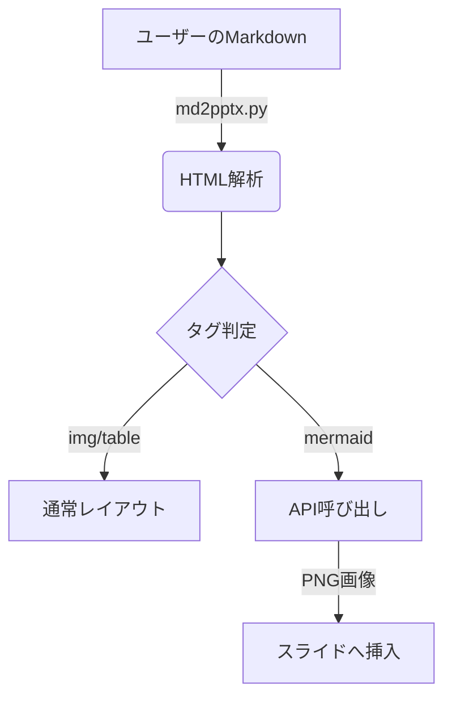

## プロジェクトの目的
AIを活用した業務効率の劇的な向上を目指します。

* **期間**: 2026年1月 〜 2026年12月
* **目標**: 手作業の80%削減

## 現状の分析と課題
現場では多くの課題が山積しています。

* 手作業によるデータ入力の負荷が高い
* 部署間での情報共有にタイムラグがある
* 既存システムの老朽化

## システム構成イメージ
<!-- layout: center -->


## 具体的な解決策
右側に画像、左側にテキストの**2カラム風**になります。

* **自動化**: Pythonによる自動生成
* **クラウド**: データの一元管理
* **UI/UX**: 直感的な操作性


## 実装コードの例（シンタックスハイライト対応）
Pygmentsによる美しいコードの色分けが適用されます。

```python
def hello_world(name: str):
    """挨拶を出力する関数"""
    message = f"Hello, {name}!"
    print(message)
    return True
```

```javascript
// JavaScriptのコードブロックも同様に色付けされます
const dxProject = {
    team: "DX",
    start: () => console.log("Started!")
};
dxProject.start();
```

## プロジェクトの役割分担表
テキストのあとに表を配置すると、自動的にテキストが上、表が下のレイアウトになります。

| 担当チーム | 役割 | メンバー数 | 使用ツール |
| :--- | :--- | :--- | :--- |
| **DX推進** | AI戦略の策定・運用 | 5名 | `AWS`, Python |
| **インフラ** | クラウド環境の構築 | 3名 | Docker, Terraform |
| **現場** | データ入力・テスト | 12名 | Excel, 専用アプリ |

## 強制的な2カラムレイアウト
<!-- layout: 2-column -->

テキストがなくても、明示的に `layout: 2-column` を指定すれば、画像は右側に配置されます。


## Mermaid図形の自動生成テスト
テキストの後に ````mermaid ```` を書くと、自動的に画像化されて右側に配置されます。

* **API**: Krokiまたはmermaid.inkを利用
* **処理**: テキスト -> Base64圧縮 -> PNG取得
* 複雑な図解もテキストエディタだけで完結します！
