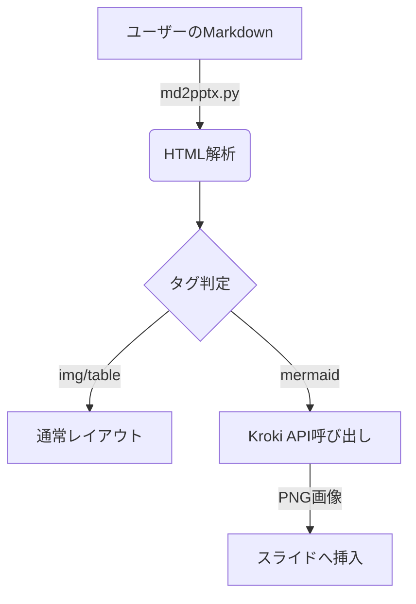

# 2026年次世代AIプロジェクト
DX推進チームによる業務改革のご提案

## プロジェクトの目的
AIを活用した業務効率の劇的な向上を目指します。

* **期間**: 2026年1月 〜 2026年12月
* **目標**: 手作業の80%削減

## 現状の分析と課題
現場では多くの課題が山積しています。

* 手作業によるデータ入力の負荷が高い
* 部署間での情報共有にタイムラグがある
* 既存システムの老朽化

## システム構成イメージ


## 具体的な解決策
右側に画像、左側にテキストの**2カラム風**になります。

* **自動化**: Pythonによる自動生成
* **クラウド**: データの一元管理
* **UI/UX**: 直感的な操作性


## 実装コードの例
インラインコードの `get_slide_size()` や、以下のコードブロックも装飾されます。

```python
def hello_world():
    print("Hello, AI Project!")
```

## プロジェクトの役割分担表
テキストのあとに表を配置すると、このようにテキストが上、表が下のレイアウトになります。インラインコードや **太字** も反映されます。

| 担当チーム | 役割 | メンバー数 | 使用ツール |
| :--- | :--- | :--- | :--- |
| **DX推進** | AI戦略の策定・運用 | 5名 | `AWS`, Python |
| **インフラ** | クラウド環境の構築 | 3名 | Docker, Terraform |
| **現場** | データ入力・テスト | 12名 | Excel, 専用アプリ |

## システム要件（表のみ）
| 項目 | スペック要件 | 備考 |
| :--- | :--- | :--- |
| サーバー | 16コア / 64GB RAM | 本番環境用 |
| データベース | PostgreSQL 16 | SSD推奨 |
| セキュリティ | WAF, VPN接続必須 | 社内規程準拠 |

## ノート機能のテスト
このテキストはスライドに表示されます。
画像や表と組み合わせることももちろん可能です。

> ここはスピーカーノートです！
> スライド上には表示されず、PowerPointのノート領域に保存されます。
> 
> 【発表のポイント】
> ・最初の3分でこのスライドを説明する
> ・質問が来たら別紙の資料を参照するように促す

## Mermaid図形の自動生成テスト
テキストの後に ````mermaid ```` を書くと、自動的に画像化されて右側に配置されます。

* **API**: Kroki.ioを利用
* **処理**: テキスト -> Base64圧縮 -> PNG取得
* 複雑な図解もテキストエディタだけで完結します！
